# cosimi: SimSimi-style chatbot

Pattern-matching chatbot in spirit of SimSimi. **No LLM at runtime.**
Replies from curated/learned pattern store, scored by four-tier
matching engine (`session_teach → exact → FTS → trigram`).

## Why I built this

Curiosity. Wanted play with SimSimi-era chatbot shape: matcher over
curated pattern store. No reasoning at runtime, no tokens billed per
turn, hallucinations bounded by what's in table.

Twist vs classic SimSimi: **LLM is crowd now.** SimSimi sourced
pairs from users at scale (uncurated). Here, LLM bulk-generates
pairs offline, admin reviews them; `/teach` flow for incremental
gap-filling, not seed. LLM stays offline — build/import time only.
Runtime never calls one.

Shape fits domains needing no reasoning: greetings, jokes, FAQs,
small-talk, canned support replies. Tier 1 leans on Postgres FTS +
trigram for fuzzy lexical match — `xin chào`, `xin chao`, `xinchao`
all hit the same row, zero embeddings. Tier 2/3 swap in pgvector to
cross the paraphrase gap without giving up the offline + admin-review
spine. See [Architecture tiers](#architecture-tiers).

## Architecture tiers

Three progressive takes on the same problem: match a user query to a
stored reply. Each tier crosses one more gap than the last. Offline
spine — LLM generates pairs from source docs, admin reviews them —
is shared across all three. Only the **store** and the **runtime
match step** change.

### Tier 1 — pure SQL cascade (current)



Offline: LLM processes source docs into Q&A pairs → admin review →
Postgres pattern store. Runtime falls through four tiers in order:
`session_teach → exact → FTS → trigram`. First hit returns its reply;
all miss returns a fallback.

Lexical only. Matches shared characters/words, not meaning. Cannot
cross paraphrase gaps — `"forgot my login"` won't reach a
`"reset password"` row.

### Tier 2 — pgvector nearest-neighbor (planned)



Same offline pair generation, but store becomes pgvector. Each
approved question is embedded by a sentence model; runtime embeds the
incoming query with the same model and matches by nearest-neighbor
cosine distance, gated by a similarity threshold.

Crosses the semantic gap — paraphrases now match — at the cost of
auditability and threshold tuning.

### Tier 3 — pairs + semantic chunks (planned)



Extends Tier 2's offline step. LLM reads docs and produces both Q&A
pairs **and** semantic chunks; both are embedded into pgvector.
Runtime nearest-neighbor searches across pairs and chunks together.
Chunks act as coverage insurance for questions the LLM didn't
anticipate as pairs.

New tuning knob: whether pairs and chunks share one threshold, or
chunks are held to a stricter cutoff.

## Docs

- **[Architecture](./docs/ARCHITECTURE.md)**: process split, matcher cascade, repo layout
- **[Setup](./docs/SETUP.md)**: first-time install, seed, dev commands
- **[Configuration](./docs/CONFIGURATION.md)**: env vars, logging, PII
- **[API](./docs/API.md)**: `curl` recipes + deployment security model
- **[LLM Import Format](./docs/LLM_IMPORT_FORMAT.md)**: bulk-import file shape
- **[CLAUDE.md](./CLAUDE.md)**: conventions, invariants, "don't repeat this mistake" rules
- **`docs/SPEC_PHASE_*.md`**: per-phase specs, in build order

## Quickstart

```bash
nvm use && corepack enable
pnpm install
cp .env.example .env
pnpm dev:all                       # postgres → migrate → api + admin-api + web
pnpm --filter @cosimi/admin dev     # admin SPA on :5174
pnpm seed                          # vi + chatterbot corpus
```

Full setup: [`docs/SETUP.md`](./docs/SETUP.md).

## Project status

**Work in progress.** Phases 0–16 merged on `main`, standing
gates (`typecheck`, `lint`, `format:check`, `test`) green, but repo
also trial run for larger portfolio app I'm building, so expect churn.
Matcher, schema, admin surface most likely to shift as
I pull patterns out into portfolio project and feed lessons back here.

**Tier roadmap.** Tier 1 (pure SQL cascade) is the implemented
baseline. Tier 2 (pgvector pairs) and Tier 3 (pairs + chunks) are
planned evolutions, not rewrites — each is a deliberate step up the
precision/capability ladder over the same offline pair-generation
spine.

Out of scope for now (may change):

- Internationalization of UI chrome. Chat content bilingual (vi/en) but
  admin chrome English-only.
- Multi-user accounts / sharing. Single-user-per-browser by design.
- Telemetry / observability dashboards. Pino → stdout → your log pipeline
  v1 story.

## Credits

- Vietnamese seed data: hand-curated.
- English seed data: [chatterbot-corpus](https://github.com/gunthercox/chatterbot-corpus)
  by Gunther Cox, BSD-3 license. See
  [`seeds/chatterbot/LICENSE`](./seeds/chatterbot/LICENSE) and
  [`seeds/chatterbot/NOTICE`](./seeds/chatterbot/NOTICE).